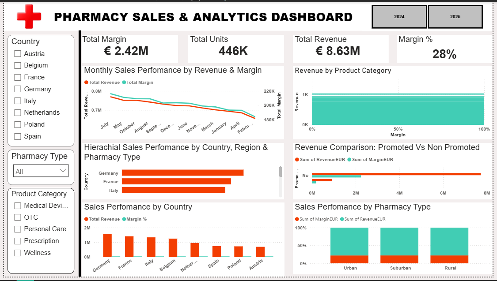

# Pharmacy Sales Analysis 💊

## 📌 Overview
This project analyzes pharmacy sales data to understand revenue trends, product demand, and performance patterns.

---

## 🧠 Tools Used
- Excel / Power BI 

---

## 📊 Business Questions Answered
- Which drugs/products sell the most?
- What are the peak sales periods?
- Which categories generate the highest revenue?

---

## 📈 Dashboard Preview

---

## 🔍 Key Insights
- Certain products drive majority of revenue
- Seasonal trends affect demand
- Some product categories underperform

---

## 📌 Conclusion
This analysis supports better inventory management and sales forecasting.
